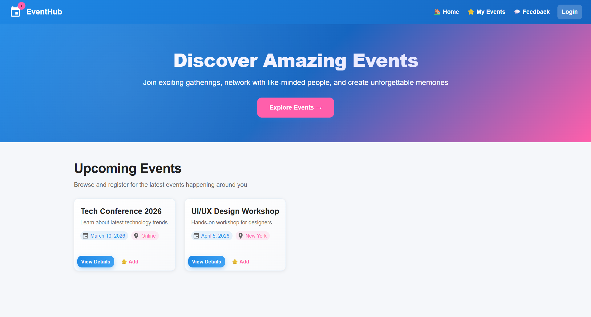
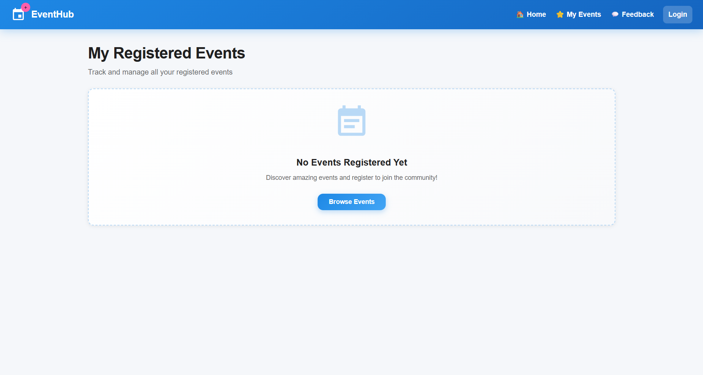
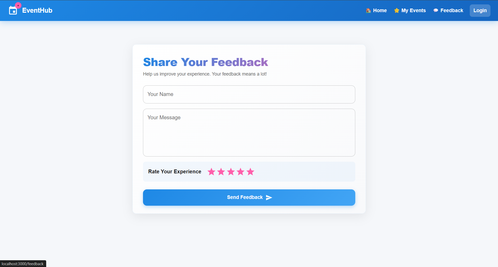
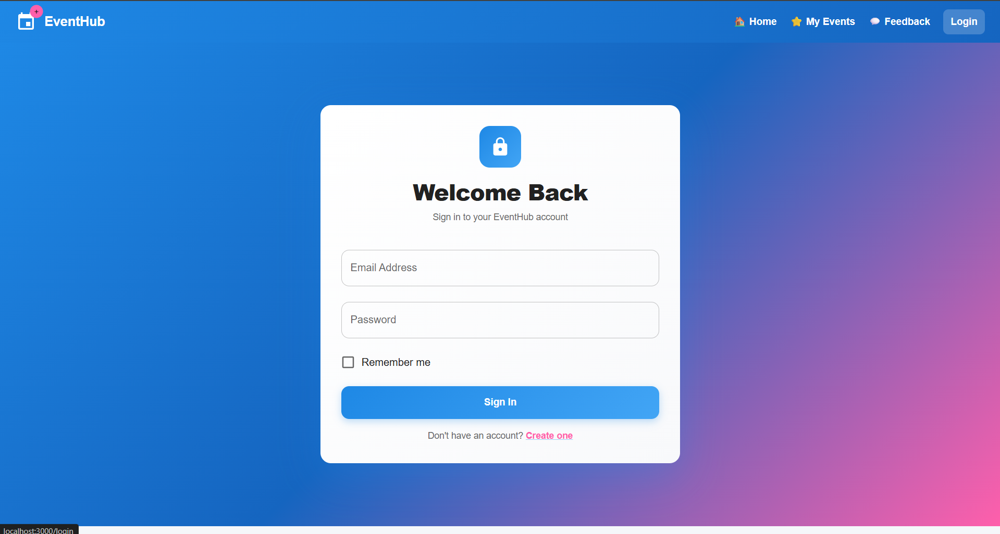

# Event Management Dashboard

Events bring people together, but finding and managing them can be challenging. This platform helps users discover, register for, and manage events effortlessly.

This project provides a web application where users can browse upcoming events, view detailed information, register for events, track their registrations, and provide feedback to organizers.

## Problem
Difficulty in discovering relevant events
No centralized way to manage event registrations
Lack of feedback mechanism for event organizers

## Solution
User-friendly event discovery and browsing
Easy registration and management of events
Feedback system for continuous improvement

## Goal
To connect people through events and enhance community engagement.

Bringing communities closer through memorable events.

## Screenshots:

